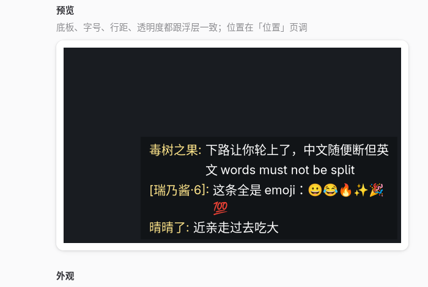

# linux-danmu-hime

把 B 站直播弹幕画在屏幕上的 Wayland 浮层（wlr-layer-shell），自己画（软件渲染，
无 GPU 依赖），点击穿透；配套一个 GTK4 设置界面。

<p align="center">
  
</p>

<p align="center">
  
</p>

## 安装

```bash
# AUR（Arch）
yay -S linux-danmu-hime

# 或者从源码
cargo build --release --bin danmu-hime
cd gui && ./install.sh --overlay ../target/release/danmu-hime
```

## 使用

桌面必须支持 `wlr-layer-shell` 协议

```bash
danmu-hime 721              # 浮层：房间号（或直播间链接）
danmu-hime-config           # 设置界面（应用菜单里叫「弹幕浮层设置」）
```

## 依赖

`gtk4` `libadwaita` `python-gobject`（界面）；`qrencode`（扫码登录画二维码，可选）；
彩色 emoji 需要 `noto-fonts-emoji`（可选）。

MIT
