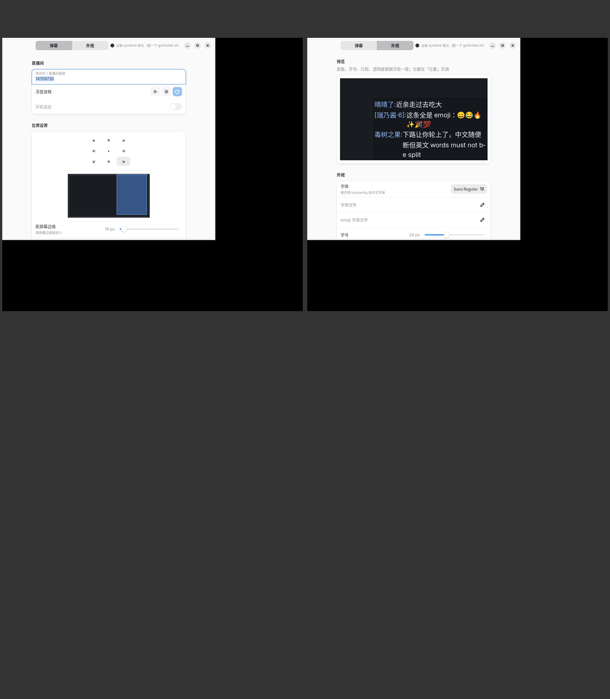

# 弹幕浮层设置（GUI）

给 `danmu-hime` 用的设置界面，用 Python + GTK4/libadwaita 写的（照抄
[niri-display-settings](https://github.com/shorin-kiwata/niri-display-settings) 的那套结构）。

界面按**哔哩哔哩弹幕姬**的习惯来：字号、位置、停留时间这些**全都是滑块**，
不让人填数字；位置用九宫格点，旁边一块「屏幕示意」显示浮层挂在哪儿。



## 跑起来

```bash
./danmu-hime-config            # 直接跑（要装了 gtk4 / libadwaita / python-gobject）
./install.sh                # 装到 ~/.local，生成 systemd 用户单元
```

`install.sh` 之后：

- 应用菜单里多一个「**弹幕浮层设置**」（`~/.local/share/applications/`）
- `~/.local/bin/danmu-hime-config` 和 `~/.local/bin/danmu-hime`
  （后者是**符号链接**到你的 `target/release/danmu-hime`，重新 build 就是新的）
- `~/.config/systemd/user/danmu-hime.service`（「运行」页的开关就是它）

## 界面

两页，进来先看到房间号：

| 页 | 有什么 |
|---|---|
| **弹幕** | ① 直播间：房间号/链接、▶ ■ ⟳ 三个图标按钮（启动/停止/重启浮层）、开机自启 ② 位置设置：九宫格选贴哪块、屏幕示意、距屏幕边缘、层级、显示器、手动缩放 ③ 弹幕节奏：停留时间、淡出时长、最多记多少条 |
| **外观** | 预览（真的按字号/行距/透明度/换行排一遍）、字体、字符文件、emoji 字体文件、字号、行距、底板不透明度、浮层宽、高度上限 |

### 登录（昵称打码就靠它）

**不登录时，有些房间/时段服务端会把昵称打成星号**（`安***`），这是服务端下发的，
客户端只能照画；登录之后发过去的认证包里 uid 不再是 0，昵称才是真的
（哔哩哔哩直播姬 bili-live-hime 就是这么干的：它的认证包 `AuthPayload { uid, protover: 3,
platform: "web", type: 2, key }` 里发的是登录 uid）。

第一页「登录」那一行：

- **从直播姬导入**：直接抄 `~/.config/com.rsplwe.bili-live-hime/app-config.json` 里
  已经登录好的 cookie（SESSDATA 等 5 项），一键完事
- 或者往下面那行**手动粘贴** cookie
- 状态会显示「已登录（uid …）」/「未登录」

改完 cookie 要让浮层重启一次（它是「只能重启生效」的项），按 ⟳ 就行。
没有 cookie 时，浮层也会自己去读 `bilibili_live_stream` 脚本的缓存
（`~/.cache/bilibili-live-stream/credentials.json`）。

## 它是怎么改到浮层的

没有 IPC：GUI 把设置写进

```
~/.config/danmu-hime/config.json
```

（原子写：先写临时文件再 rename，免得浮层读到半截 JSON。）浮层启动时读这个文件，
之后**每帧都看一眼 mtime**，变了就热重载——字号、行距、透明度、停留时间、淡出、
最多几条、缩放、位置、层级、宽高、边距都是**改完立刻生效**。

只有这几项要重启浮层（房间要重连、字体要重新 mmap、显示器要重建 surface）：

```
room  cookie  output  font  emoji_font
```

保存时会弹一条「已保存；房间/cookie/字体/显示器要重启才生效」，按「重启」按钮就行。

## 开发

```bash
python3 -m unittest discover -s tests     # 或者 pytest tests
```

- `danmu_hime/config.py`：读写那份 JSON（键跟 Rust 那边的 `FileConfig` 一一对应）
- `danmu_hime/service.py`：`systemctl --user` 的薄壳
- `danmu_hime/window.py`：界面；滑块/九宫格都在 `_add_slider`、`_page_position` 里
- `danmu_hime/i18n.py`：中英文字符串表（认 `LANG=zh_*`）
